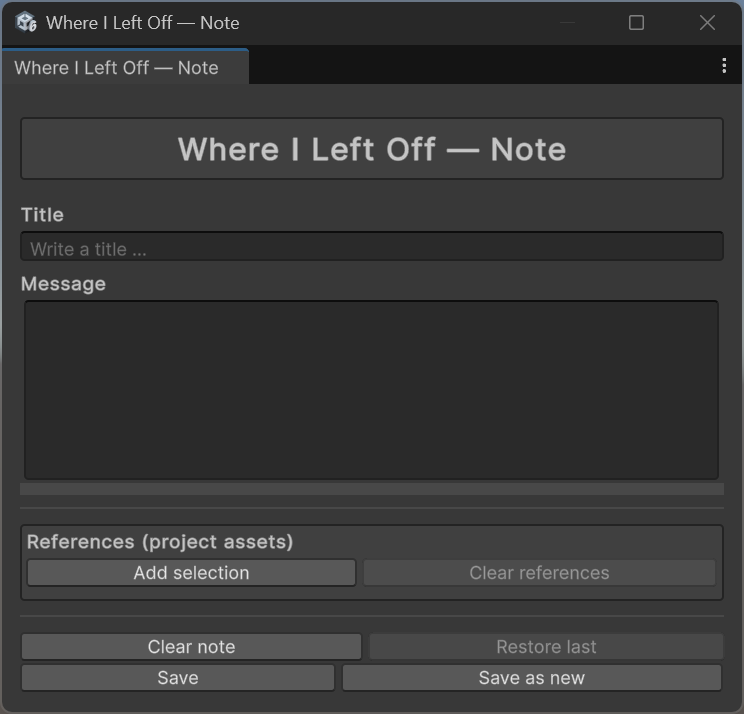
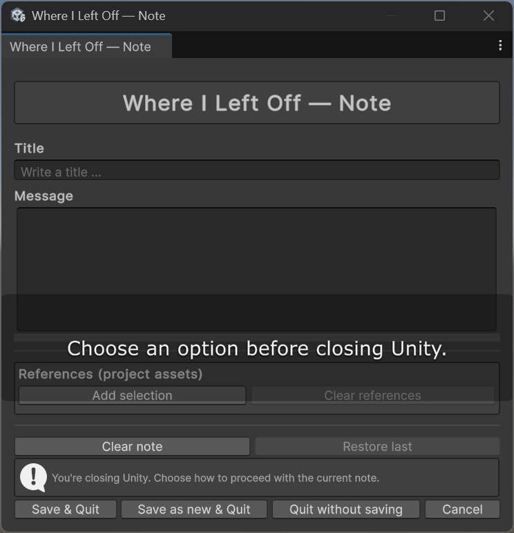
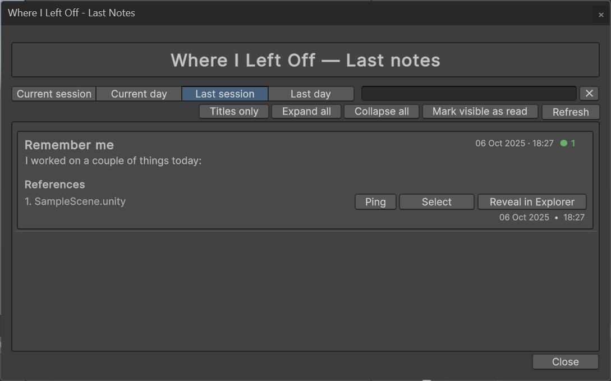
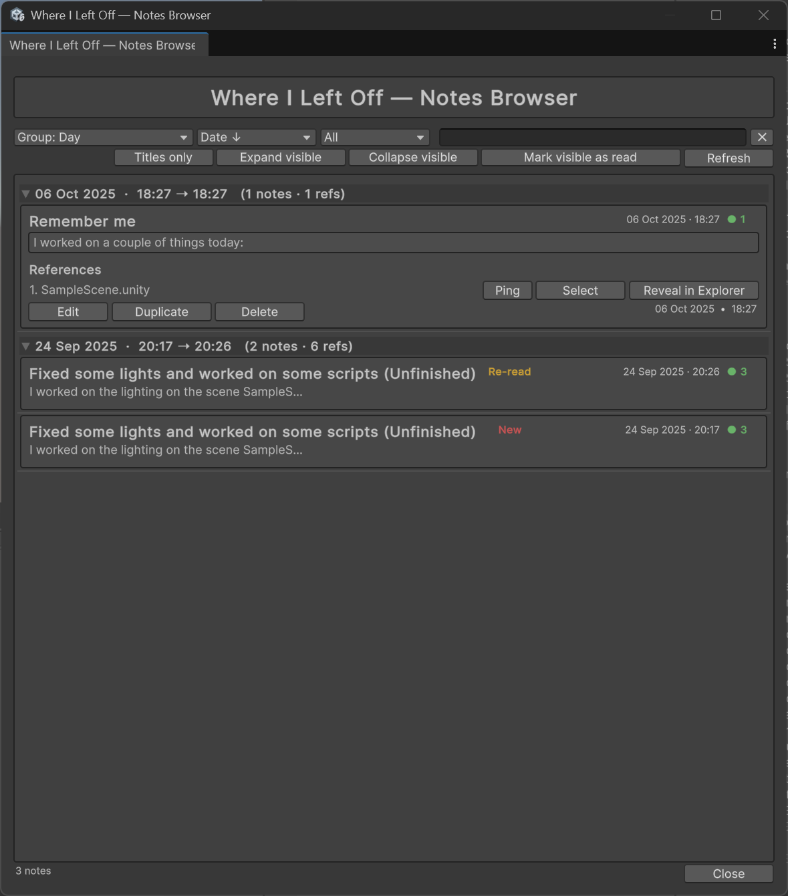
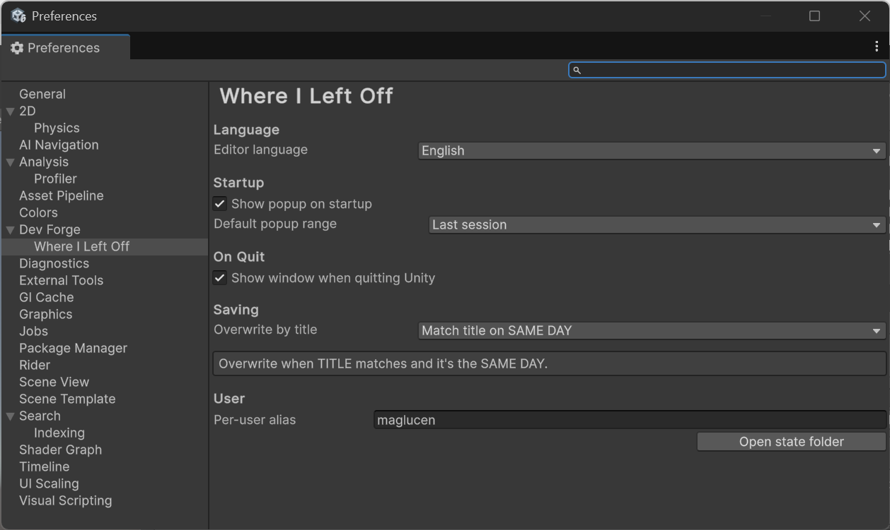

# Where I Left Off (WILO)

> Instantly pick up work where you left off in Unity.  
> Leave a note on quit, see it on next launch — lightweight, local, Editor-only.

---

## 🎬 Demo

---

## ✨ Features
- **Exit popup**: jot a note before quitting (or cancel quit).
- **Startup reminder**: shows the last session/day note on launch.
- **Notes Browser**: searchable, filter by text/date, group by day/session.
- **Titles-only mode**: ultra-compact view for fast scanning.
- **Reference badges** (`● N`): ping, open or reveal asset references.
- **Keyboard shortcuts**: `Ctrl/Cmd + F` focus search, `Esc` clear.
- **Persistence**: search, filters, and layout remembered per project.
- **Zero-friction**: no external services, no mandatory setup.
- **Local data**: JSON under `Library/` (keeps VCS clean).
- **Localization**: Spanish UI/docs or English.
- **Editor-only**: excluded from builds, safe for runtime.
- **UPM-friendly**: install via Git URL for easy updating.

---

## 📦 Install (UPM)

**Recommended (Git URL):**
1. Open **Window → Package Manager**.
2. Click **Add package from Git URL…**  
   Paste:  https://github.com/DevForgeTools/WhereILeftOff.git

**From disk (local clone):**
1. Open **Window → Package Manager**.
2. Click **Add package from disk…** and select `package.json` inside  
   `Packages/com.devforge.whereileftoff/`.

---

## 🚀 Quickstart (60 s)
1. Work as usual in Unity.
2. On **quit**, write a **one-liner note** in the popup (or cancel quit).
3. On **start**, you’ll see the reminder.  
   To manage notes:
- **Tools → DevForge → Where I Left Off → Browser**

---

## 🧭 Menus
- **Tools → DevForge → Where I Left Off → Note**
- **Tools → DevForge → Where I Left Off → Last Notes**
- **Tools → DevForge → Where I Left Off → Browser**
- **Tools → DevForge → Where I Left Off → Open Documentation**

---

## ⚙️ Settings
Open **Edit → Preferences… → Where I Left Off** (or the ⚙️ in the Browser).

Options:
- Show popup on **Quit**.
- Show popup on **Startup** (last session or last day).
- Overwrite options **Per session** or **Per day** with same title
- Language: `EN | ES`.

---

## 📁 Data
- Notes: `Library/WhereILeftOff/*.json`
- User state: `Library/WhereILeftOff/User/*`

> These files **shouldn’t** be versioned.  
> To migrate, copy them manually between machines.

---

## 🖱️ Usage
- **Quit**: write and save. You can **cancel** quitting.
- **Open**: see the reminder; dismiss it or open the **Browser**.
- **Browser**: search, filter, ping/open refs, edit or duplicate notes.

---

## 🧪 Compatibility
- Tested on **Unity 6**.
- **Editor-only** package (excluded from builds).

---

## ❓ FAQ
- **Can I disable popups?** Yes, via **Preferences** or from the Browser.
- **Cloud sync?** No. Local by design.
- **Export/Import?** Copy the JSON files under `Library/WhereILeftOff/`.
- **Localization?** Choose between Spanish or English.

---

## 📸 Screenshots

<!-- Fila 1 -->
&nbsp;

<!-- Fila 2 -->
&nbsp;

<!-- Preferencias -->

## 💬 Support
- Open an issue: [GitHub Issues](https://github.com/DevForgeTools/WhereILeftOff/issues)
- Or contact us directly at:
>maglucen@gmail.com

---

